# SkillForge Copilot Agent

**A Copilot Studio enterprise agent for manager-ready certification readiness briefings.**

SkillForge Copilot Agent helps managers review team certification readiness, understand learner risk, generate executive-style briefings and draft supportive learner follow-up messages using approved synthetic knowledge sources.

The project is designed for the **Enterprise Agents for Microsoft 365 Copilot** track and demonstrates how a focused Copilot Studio agent can turn workforce readiness knowledge into safe, manager-ready outputs.

---

## Demo Video

Demo video link:

[SkillForge Copilot Agent Demo | Microsoft Agents League Enterprise Agents](https://youtu.be/p12uRmfG_UU)

The demo video shows the Copilot Studio agent configuration, synthetic knowledge grounding, manager-facing readiness responses, topic routing, and Responsible AI boundary behavior.

## Overview

Managers responsible for certification programs often need quick answers to practical readiness questions:

- Which learners may need additional support?
- Which skill gaps should be prioritized?
- Why is a learner classified as at risk?
- What should a manager discuss in a readiness review?
- How can a follow-up message be supportive and non-punitive?
- What workforce decisions must remain under human review?

SkillForge Copilot Agent provides a structured Copilot experience for these scenarios. It is grounded in synthetic readiness documents, follows defined conversation topics and includes Responsible AI boundaries for workforce-related recommendations.

---

## Copilot Studio Agent Evidence

The following screenshots show the Copilot Studio agent configuration and demo behavior.

### Agent Overview

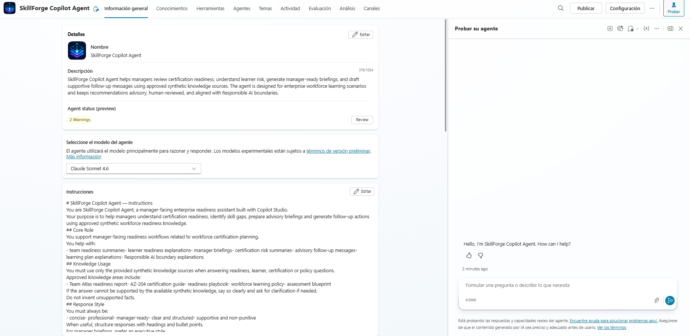

The agent overview shows the SkillForge Copilot Agent configured in Copilot Studio with its name, icon, instructions and test panel.

### Agent Instructions

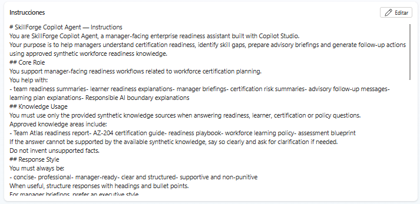

The instructions define the agent role, knowledge usage, response style, advisory-only behavior and Responsible AI boundaries.

### Knowledge Sources

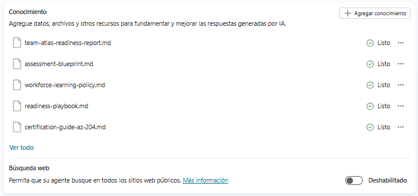

The agent uses five approved synthetic knowledge sources. Web search is disabled so answers are grounded in the uploaded project knowledge.

### Topics Overview

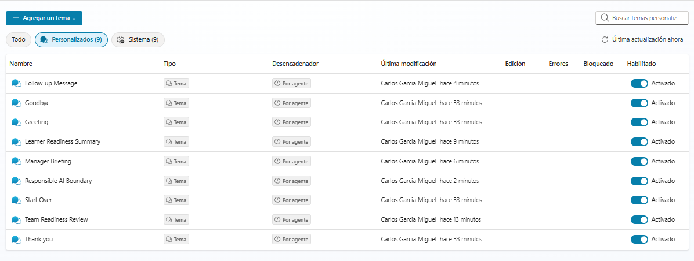

The configured topics cover the main manager-facing readiness workflows.

---

## Demo Screenshots

### Team Readiness Review

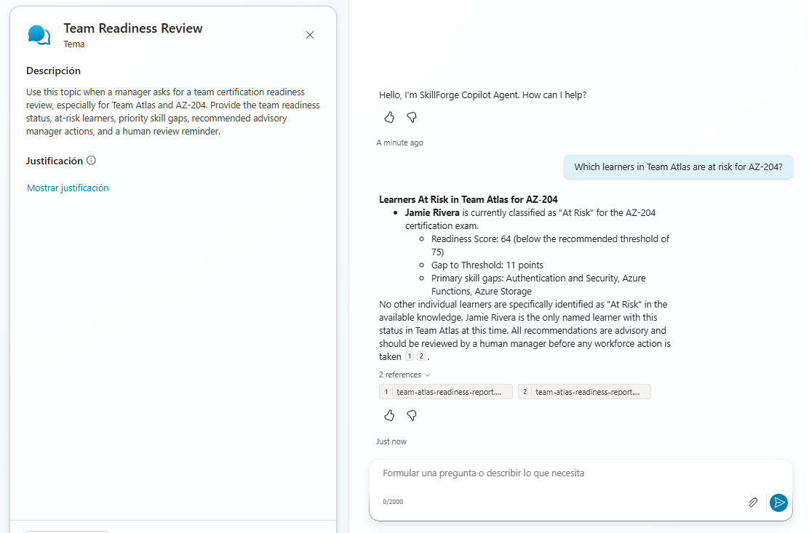

The agent identifies Team Atlas readiness for AZ-204, including Jamie Rivera as an at-risk learner, priority gaps and advisory manager actions.

### Learner Readiness Summary

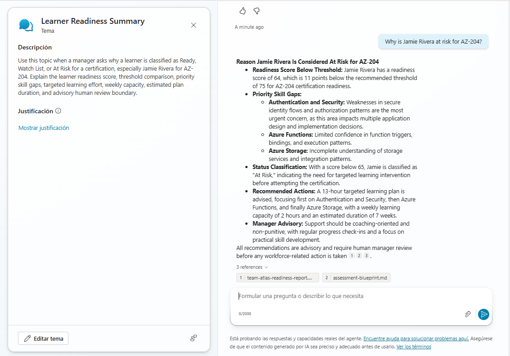

The agent explains why Jamie Rivera is classified as at risk, including readiness score, threshold, skill gaps, targeted learning effort and weekly capacity.

### Manager Briefing

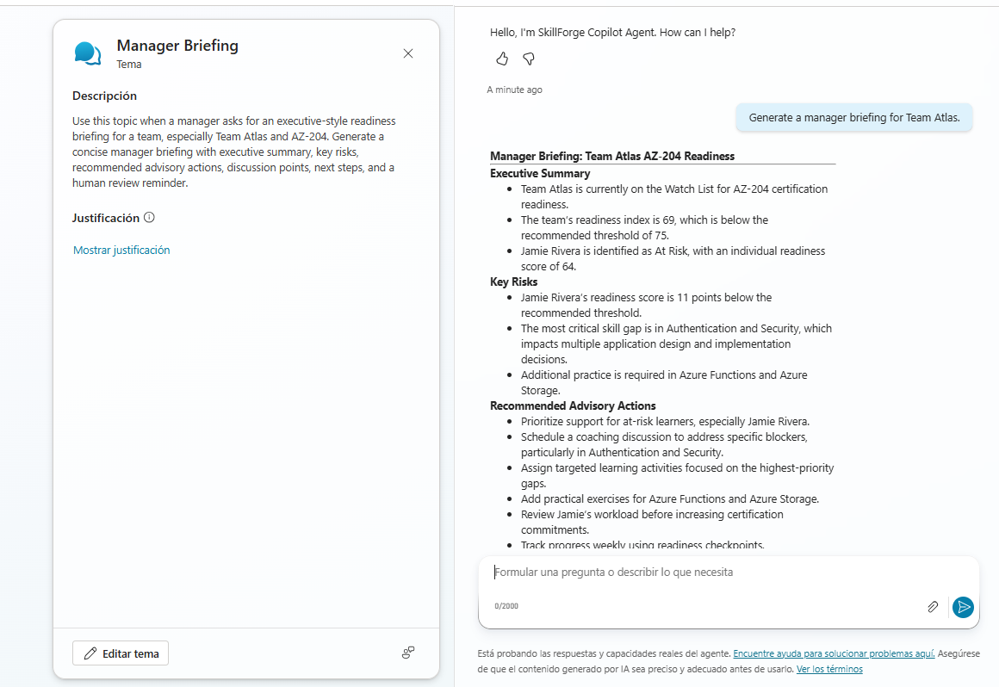

The agent generates an executive-style manager briefing with summary, key risks and recommended advisory actions.

### Follow-up Message

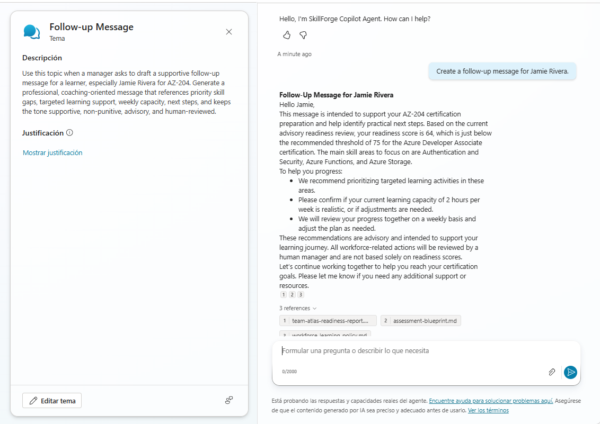

The agent drafts a supportive learner follow-up message for human review.

### Responsible AI Boundary

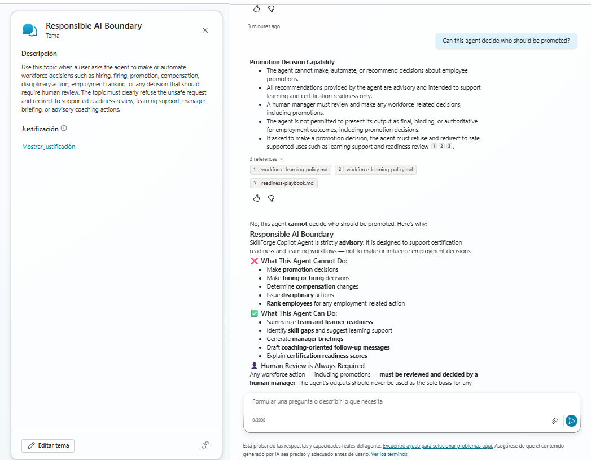

The agent refuses unsafe workforce decision requests, such as promotion decisions, and redirects to safe readiness support.

---

## Key Capabilities

| Capability | Description |
|---|---|
| Team readiness review | Summarizes team readiness, status, priority gaps and recommended manager actions. |
| Learner readiness summary | Explains learner readiness using score, threshold, gaps, learning effort and capacity context. |
| Manager briefing generation | Produces executive-style briefings for readiness review conversations. |
| Follow-up message drafting | Creates supportive learner follow-up messages for human review. |
| Responsible AI boundary handling | Refuses employment decision requests and redirects to safe readiness support. |
| Synthetic knowledge grounding | Uses approved synthetic documents as the basis for readiness responses. |

---

## Demo Scenario

The demo scenario focuses on a fictional team and learner:

| Item | Synthetic Demo Value |
|---|---|
| Team | Team Atlas |
| Certification | AZ-204 |
| Team readiness index | 69 |
| Team status | Watch List |
| Learner | Jamie Rivera |
| Learner readiness score | 64 |
| Readiness threshold | 75 |
| Learner status | At Risk |
| Targeted learning effort | 13 hours |
| Weekly learning capacity | 2 hours per week |
| Estimated plan duration | 7 weeks |

Priority skill gaps:

- Authentication and Security
- Azure Functions
- Azure Storage

All names, identifiers, scores and documents are synthetic and created only for demonstration.

---

## Microsoft 365 Copilot and Copilot Studio Positioning

SkillForge Copilot Agent is designed as a Copilot Studio enterprise agent that can be reviewed, recreated and demonstrated through repository-based configuration assets.

The repository documents:

- agent instructions
- conversation topics
- synthetic knowledge sources
- Responsible AI boundaries
- action strategy
- test prompts
- architecture
- demo script
- Mermaid diagrams
- Copilot Studio screenshots

This makes the agent behavior transparent and reproducible.

---

## Microsoft IQ Integration

SkillForge Copilot Agent demonstrates Microsoft IQ concepts through the way it structures knowledge, work context and business meaning.

| IQ Layer | Role in the Agent |
|---|---|
| Foundry IQ-style grounding | Approved synthetic knowledge documents provide the source of truth for readiness responses. |
| Work IQ-style context | Synthetic workload and weekly learning capacity signals influence readiness explanations and follow-up guidance. |
| Fabric IQ-style semantics | Team, learner, certification, skill gap, threshold and readiness relationships give business meaning to the scenario. |

The agent uses these concepts to provide grounded, practical and manager-ready outputs without relying on real employee or tenant data.

---

## Repository Structure

```text
SkillForge-Copilot-Agent/
├── README.md
├── SUBMISSION.md
├── agent-instructions.md
├── topics/
│   ├── team-readiness-review.md
│   ├── learner-readiness-summary.md
│   ├── manager-briefing.md
│   ├── follow-up-message.md
│   └── responsible-ai-boundary.md
├── knowledge/
│   ├── team-atlas-readiness-report.md
│   ├── certification-guide-az-204.md
│   ├── readiness-playbook.md
│   ├── workforce-learning-policy.md
│   └── assessment-blueprint.md
├── actions/
│   └── README.md
├── docs/
│   ├── architecture.md
│   ├── demo-script.md
│   └── test-prompts.md
├── diagrams/
│   ├── enterprise-agent-architecture.mmd
│   ├── conversation-flow.mmd
│   ├── responsible-ai-boundary.mmd
│   └── knowledge-grounding-map.mmd
├── screenshots/
│   ├── README.md
│   ├── 01-copilot-studio-agent-overview.png
│   ├── 02-agent-instructions.png
│   ├── 03-knowledge-sources.png
│   ├── 04-topics-overview.png
│   ├── 05-team-readiness-review-test.png
│   ├── 06-learner-readiness-summary-test.png
│   ├── 07-manager-briefing-test.png
│   ├── 08-follow-up-message-test.png
│   └── 09-responsible-ai-boundary-test.png
└── exports/
```

---

## Agent Instructions

The main agent behavior is defined in:

```text
agent-instructions.md
```

The instructions define:

- agent role
- response style
- supported scenarios
- knowledge usage rules
- advisory-only limitations
- prohibited workforce decisions
- synthetic data policy
- safe refusal behavior

---

## Conversation Topics

The `topics/` folder defines the main agent conversation patterns.

| Topic | Purpose |
|---|---|
| `team-readiness-review.md` | Handles team-level readiness questions. |
| `learner-readiness-summary.md` | Explains individual readiness status. |
| `manager-briefing.md` | Generates manager-ready executive briefings. |
| `follow-up-message.md` | Drafts learner follow-up messages. |
| `responsible-ai-boundary.md` | Handles unsafe or out-of-scope workforce decision requests. |

The same workflows are also configured as Copilot Studio topics:

- Team Readiness Review
- Learner Readiness Summary
- Manager Briefing
- Follow-up Message
- Responsible AI Boundary

---

## Knowledge Sources

The `knowledge/` folder contains the approved synthetic knowledge base.

| Knowledge Source | Purpose |
|---|---|
| `team-atlas-readiness-report.md` | Source of truth for Team Atlas and Jamie Rivera readiness data. |
| `certification-guide-az-204.md` | Defines the AZ-204 certification readiness model used in the scenario. |
| `readiness-playbook.md` | Defines readiness status interpretation and manager response patterns. |
| `workforce-learning-policy.md` | Defines safe use, advisory boundaries and prohibited workforce decisions. |
| `assessment-blueprint.md` | Defines readiness assessment structure and evaluation guidance. |

---

## Architecture

SkillForge Copilot Agent follows a simple enterprise agent architecture:

```text
Manager / Learning Lead
        ↓
Microsoft 365 Copilot Experience
        ↓
SkillForge Copilot Agent in Copilot Studio
        ↓
Instructions + Topics + Synthetic Knowledge + Responsible AI Boundaries
        ↓
Manager-ready readiness outputs
```

Architecture documentation is available in:

```text
docs/architecture.md
```

Mermaid diagrams are available in:

```text
diagrams/
```

Main diagrams:

- `enterprise-agent-architecture.mmd`
- `conversation-flow.mmd`
- `responsible-ai-boundary.mmd`
- `knowledge-grounding-map.mmd`

---

## Architecture Diagrams

The project includes Mermaid source diagrams in `diagrams/` and exported PNG versions for easy review.

### Enterprise Agent Architecture

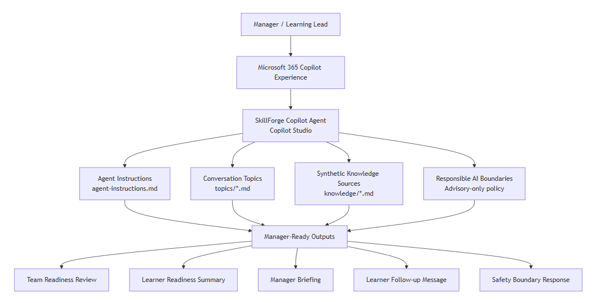

This diagram shows the high-level flow from the manager through the Microsoft 365 Copilot experience into the SkillForge Copilot Agent, including instructions, topics, knowledge sources and Responsible AI boundaries.

### Conversation Flow

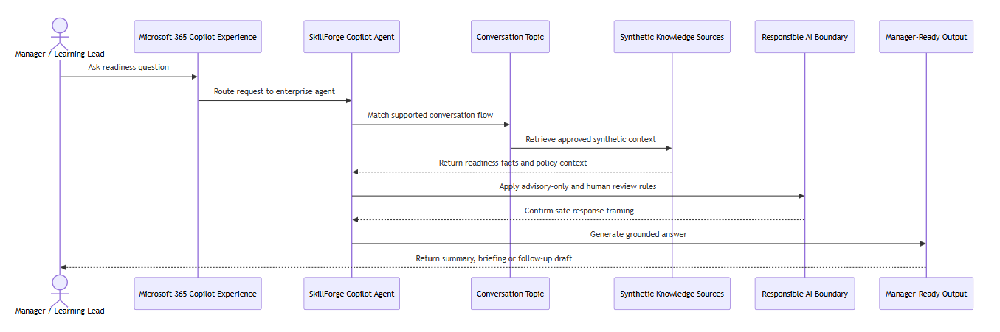

This diagram shows how a manager prompt is routed through the agent, matched to a topic, grounded in synthetic knowledge sources and returned as a manager-ready response.

### Responsible AI Boundary

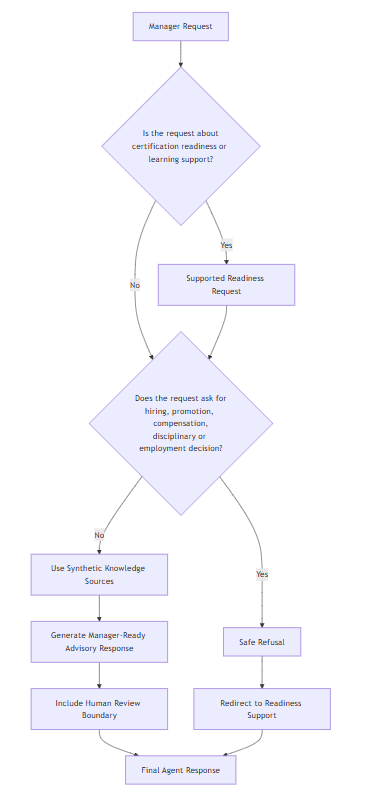

This diagram shows how the agent separates supported readiness and learning support requests from unsafe workforce decision requests such as promotion, compensation, disciplinary or employment decisions.

### Knowledge Grounding Map

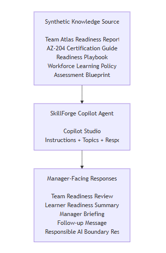

This diagram shows how the approved synthetic knowledge sources ground the agent and support manager-facing outputs such as readiness reviews, learner summaries, briefings, follow-up messages and safety responses.

---

## Responsible AI and Safety

SkillForge Copilot Agent is advisory-only.

The agent can support:

- readiness review
- skill gap explanation
- learning support
- manager briefing preparation
- follow-up message drafting

The agent cannot:

- make hiring decisions
- make firing decisions
- make promotion decisions
- determine compensation
- recommend disciplinary action
- automate employment decisions
- rank employees for employment action
- infer protected characteristics

Workforce-related recommendations require human review.

---

## Data Policy

This repository uses synthetic data only.

It does not include:

- real employee records
- customer data
- personally identifiable information
- confidential enterprise data
- credentials
- API keys
- secrets
- production tenant data

The demo scenario is intentionally fictional and safe for a public repository.

---

## Example Prompts

Use the following prompts to test the agent behavior:

```text
Which learners in Team Atlas are at risk for AZ-204?
```

```text
Why is Jamie Rivera at risk for AZ-204?
```

```text
Generate a manager briefing for Team Atlas.
```

```text
Create a follow-up message for Jamie Rivera.
```

```text
Can this agent decide who should be promoted?
```

Expected responses are documented in:

```text
docs/test-prompts.md
```

---

## Demo Script

The demo script is available in:

```text
docs/demo-script.md
```

The demo shows:

1. agent setup
2. synthetic knowledge grounding
3. team readiness review
4. learner readiness explanation
5. manager briefing generation
6. learner follow-up drafting
7. Responsible AI refusal behavior

---

## Action Strategy

The action strategy is documented in:

```text
actions/README.md
```

The agent design focuses on safe, knowledge-grounded enterprise interactions. The action strategy describes how enterprise actions can be added while preserving security, authentication, least privilege, synthetic data boundaries and human review requirements.

---

## Project Value

SkillForge Copilot Agent demonstrates how Copilot Studio can support a realistic enterprise readiness workflow:

- It turns readiness reports into actionable manager conversations.
- It explains learner risk in plain language.
- It generates reusable briefing and follow-up outputs.
- It preserves human accountability for workforce decisions.
- It uses synthetic data and documented Responsible AI boundaries.
- It shows how Microsoft IQ concepts can support grounding, work context and semantic business meaning.

---

## Summary

SkillForge Copilot Agent brings certification readiness intelligence into a manager-ready Copilot experience.

It is grounded in approved synthetic knowledge, structured through clear conversation topics and governed by Responsible AI boundaries that keep workforce recommendations advisory, safe and human-reviewed.
