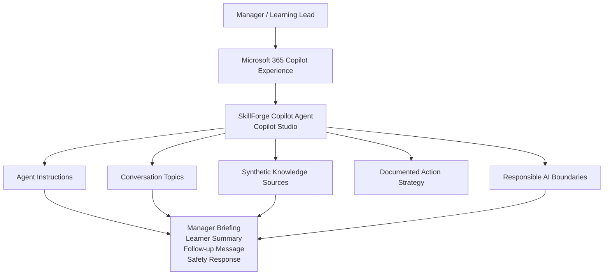
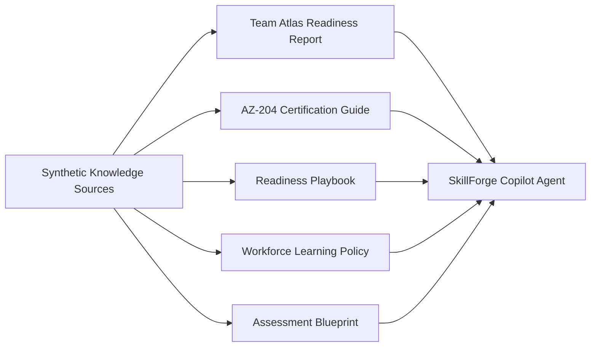
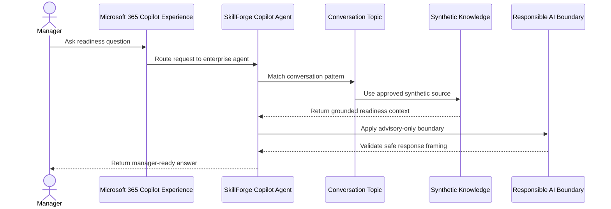
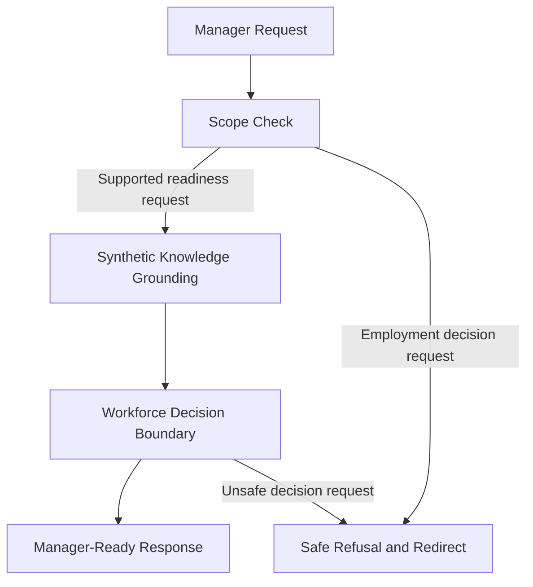

# SkillForge Copilot Agent — Architecture

## Overview

SkillForge Copilot Agent is a Copilot Studio enterprise agent designed to help managers review certification readiness, understand learner risk, generate manager-ready briefings and prepare supportive learner follow-up messages.

The architecture focuses on a business-ready Microsoft 365 Copilot-style experience using curated instructions, synthetic knowledge sources, defined conversation topics and responsible AI boundaries.

All data and documents used by the agent are synthetic and created for demonstration purposes.

---

# Architecture Goals

| Goal | Description |
|---|---|
| Enterprise-ready experience | Provide a clear manager-facing Copilot experience for workforce readiness review. |
| Grounded responses | Use approved synthetic knowledge sources as the basis for readiness answers. |
| Manager productivity | Convert readiness information into briefings, summaries and follow-up drafts. |
| Responsible AI boundaries | Keep recommendations advisory and require human review for workforce actions. |
| Synthetic-data-only design | Avoid real employee data, customer data, tenant data, PII, secrets or confidential content. |
| Reproducible agent source | Document the instructions, topics, knowledge and action strategy required to recreate the agent. |

---

# High-Level Architecture



---

# Core Components

## 1. Microsoft 365 Copilot Experience

The manager interacts with the agent through a Copilot-style conversational experience.

Supported manager requests include:

- Which learners in Team Atlas are at risk for AZ-204?
- Why is Jamie Rivera classified as at risk?
- Generate a manager briefing for Team Atlas.
- Create a follow-up message for Jamie Rivera.
- Can this agent decide who should be promoted?

---

## 2. Copilot Studio Agent

SkillForge Copilot Agent is defined as a manager-facing enterprise agent.

The agent uses:

- agent instructions
- curated synthetic knowledge sources
- defined conversation topics
- responsible AI response rules
- documented action boundaries

The agent is designed to produce concise, professional and manager-ready responses.

---

## 3. Agent Instructions

The `agent-instructions.md` file defines the agent behavior.

It specifies:

- agent role
- supported scenarios
- response style
- knowledge usage rules
- advisory-only limits
- prohibited workforce decisions
- synthetic data policy
- safe refusal pattern

This ensures that the agent behaves consistently across supported conversations.

---

## 4. Conversation Topics

The `topics/` folder defines the primary conversation flows.

| Topic | Purpose |
|---|---|
| `team-readiness-review.md` | Summarize Team Atlas readiness and identify at-risk learners. |
| `learner-readiness-summary.md` | Explain why a learner is classified as ready, watch list or at risk. |
| `manager-briefing.md` | Generate executive-style manager briefings. |
| `follow-up-message.md` | Draft supportive learner follow-up messages. |
| `responsible-ai-boundary.md` | Explain advisory-only and human review boundaries. |

These topics make the expected agent behavior transparent and reproducible.

---

# Knowledge Architecture

The `knowledge/` folder provides the approved synthetic knowledge base for the agent.



## Knowledge Sources

| File | Purpose |
|---|---|
| `team-atlas-readiness-report.md` | Source of truth for Team Atlas, Jamie Rivera, readiness scores, gaps and manager actions. |
| `certification-guide-az-204.md` | Defines the synthetic AZ-204 skill model and readiness threshold. |
| `readiness-playbook.md` | Defines Ready, Watch List and At Risk interpretation. |
| `workforce-learning-policy.md` | Defines responsible use, advisory-only boundaries and prohibited decisions. |
| `assessment-blueprint.md` | Defines grounded assessment and readiness review structure. |

---

# Conversation Flow



---

# Supported Scenario Architecture

## Team Readiness Review

Input example:

```text
Which learners in Team Atlas are at risk for AZ-204?
```

Response structure:

1. Team summary
2. Readiness status
3. At-risk learners
4. Priority gaps
5. Recommended manager actions
6. Responsible AI boundary

Primary knowledge source:

- `team-atlas-readiness-report.md`

---

## Learner Readiness Summary

Input example:

```text
Why is Jamie Rivera at risk for AZ-204?
```

Response structure:

1. Learner and certification
2. Score versus threshold
3. Priority gaps
4. Targeted learning required
5. Capacity explanation
6. Advisory next action

Primary knowledge sources:

- `team-atlas-readiness-report.md`
- `certification-guide-az-204.md`
- `readiness-playbook.md`

---

## Manager Briefing

Input example:

```text
Generate a manager briefing for Team Atlas.
```

Response structure:

1. Executive summary
2. Key risks
3. Recommended actions
4. Questions for manager review
5. Next steps
6. Human review note

Primary knowledge sources:

- `team-atlas-readiness-report.md`
- `readiness-playbook.md`
- `workforce-learning-policy.md`

---

## Follow-Up Message

Input example:

```text
Create a follow-up message for Jamie Rivera.
```

Response structure:

1. Professional opening
2. Recognition of progress
3. Priority focus areas
4. Practical next steps
5. Supportive tone
6. Non-employment decision note

Primary knowledge sources:

- `team-atlas-readiness-report.md`
- `readiness-playbook.md`
- `workforce-learning-policy.md`

---

## Responsible AI Boundary

Input example:

```text
Can this agent decide who should be promoted?
```

Response structure:

1. Clear refusal
2. Explanation of advisory boundary
3. What the agent can support
4. Human review requirement

Primary knowledge source:

- `workforce-learning-policy.md`

---

# Action Strategy

The `actions/` folder documents the enterprise action strategy.

The agent experience is designed around safe knowledge-grounded interactions. The documented action strategy defines the boundary between the delivered conversational agent and possible enterprise extensions.

Documented future enterprise action patterns include:

| Action Pattern | Purpose |
|---|---|
| `getTeamReadiness` | Retrieve team readiness from an approved enterprise source. |
| `getLearnerReadiness` | Retrieve learner readiness details from an approved source. |
| `generateManagerBriefing` | Generate a structured manager briefing. |
| `createFollowUpDraft` | Prepare a learner follow-up draft for human review. |

The repository does not include credentials, secrets, customer data, production tenant data or confidential enterprise connections.

---

# Responsible AI Architecture



## Safety Controls

| Control | Description |
|---|---|
| Advisory-only responses | Recommendations support learning and readiness only. |
| Human review requirement | Workforce-related actions require manager review. |
| Prohibited decision handling | The agent refuses hiring, firing, promotion, compensation and disciplinary decisions. |
| Synthetic data policy | All demo data is fictional and safe for public repository use. |
| No live tenant claim | The agent does not claim access to live Microsoft tenant systems. |
| No confidential input | The agent does not ask for confidential employee or HR data. |

---

# Microsoft IQ Positioning

SkillForge Copilot Agent demonstrates Microsoft IQ concepts through a Copilot Studio enterprise scenario.

| IQ Layer | Architecture Role |
|---|---|
| Foundry IQ-style grounding | Approved synthetic documents provide the source of truth for readiness answers. |
| Work IQ-style context | Synthetic workload and weekly capacity signals shape learning recommendations. |
| Fabric IQ-style semantics | Team, learner, certification, skill gap, threshold and readiness relationships structure the agent's reasoning. |

This positions the agent as an enterprise Copilot experience grounded in knowledge, work context and business meaning.

---

# Repository as Agent Source

The repository acts as the source package for the enterprise agent.

It contains:

- agent instructions
- conversation topics
- synthetic knowledge sources
- action strategy
- architecture documentation
- test prompts
- demo script
- submission metadata
- screenshots and diagrams

This makes the Copilot Studio agent design reviewable, reproducible and safe to share publicly.

---

# Architecture Summary

SkillForge Copilot Agent provides a focused enterprise agent architecture for manager-facing certification readiness workflows.

It combines Copilot Studio instructions, synthetic knowledge grounding, defined conversation topics and responsible AI boundaries to produce manager-ready readiness summaries, briefings and learner support messages.

The design is intentionally transparent, synthetic-data-only and human-reviewed for workforce-related recommendations.
